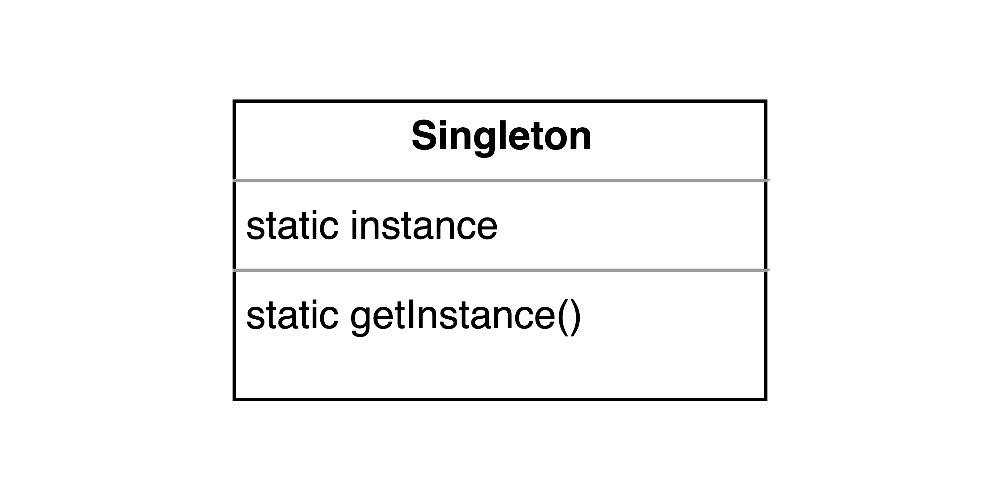

# 设计模式大冒险第四关：单例模式，如何成为你的“唯一”


这一篇文章是关于[设计模式大冒险系列](https://mp.weixin.qq.com/mp/appmsgalbum?__biz=MzAwMDIzODY5MA==&action=getalbum&album_id=1557269952766771201&scene=173&subscene=0&sessionid=0&enterid=1607352063&from_msgid=2247484057&from_itemidx=1&count=3#wechat_redirect)的第四篇文章，**这一系列的每一篇文章我都希望能够通过通俗易懂的语言描述或者日常生活中的小例子来帮助大家理解好每一种设计模式**。今天这篇文章来跟大家一起学习一下[单例模式](https://en.wikipedia.org/wiki/Singleton_pattern)。相信读完这篇文章之后，你肯定会有所收获的。

关于单例模式，这应该是设计模式中最简单的一种了。大家如果学习过设计模式，可能很多设计模式长时间不用就忘记了，但是对于单例模式来说，你肯定不会忘记。**因为它的理论知识比较简单，实践起来也很方便**。

**但是，你真的会正确的使用单例模式吗**？你知道单例模式在什么情况下使用是合适的，什么情况下使用会造成很多麻烦吗？还是你只是把它当做一个全局变量去使用，只是因为这样开发很方便，不用写很多的代码。今天这篇文章我们就来一起好好学习一下单例模式。让我们开始吧。

## 单例模式的介绍

首先我们先来看一下单例模式的定义是什么。**所谓的单例模式，就是指对于一个具体的类来说，它有且只有一个实例，这个类负责创建唯一的实例，并且对外提供一个全局的访问接口**。

单例模式的UML类图可以用下图表示：



那么我们为什么要使用单例模式呢？**举一个生活中的场景，在平时你过马路的时候，给你信号提示你能不能穿过马路的交通信号灯是不是只有一个？因为在这种情况下，如果同时有两个信号灯的话，你是不知道该不该在此时穿过马路的**。

所以类比到我们的软件开发中，也是这么一个道理。**在一个系统中，某种用途的实例会存在唯一的一个。这个实例可能用来保存应用中的一些状态，或者执行某些任务**。比如在前端开发中，我们常常会使用一些应用的状态管理库，比如[Vuex](https://vuex.vuejs.org/zh/guide/)或者[Redux](https://redux.js.org/)。那么在我们的应用中，对于管理状态的实例也只能有一个，如果有多个的话就会让应用的状态出现问题，从而导致应用发生一些错误。

## 单例模式的实现

接下来我们来看一下单例模式是如何实现的。通过上面的UML类图，我们可以知道，**对于一个类来说，我们需要一个静态变量来保存实例的引用，还需要对外提供一个获取实例的静态方法**。如果使用 **ES6** 的类的语法来实现的话，可以简单的用下面的代码来表示：

```javascript
class Singleton {
	// 类的静态属性
	static instance = null;

	// 类的静态方法
	static getInstance() {
		if (this.instance === null) {
			this.instance = new Singleton();
		}
		return this.instance;
	}
}

const a = Singleton.getInstance();
const b = Singleton.getInstance();

console.log(a === b); // true
```

上面的代码还是比较简单的，相信大家看一下就知道怎么实现了。**需要注意的一点是，在类的静态方法中，this指的是类，而不是实例**。

下面我们再使用函数的方式来实现一次：

```javascript
const Singleton = (function() {
	let instance;

	// 初始化单例对象的方法
	function initInstance() {
		return {};
	}

	return {
		getInstance() {
			if (instance === null) {
				instance = initInstance();
			}
			return instance;
		},
	};
})();

const a = Singleton.getInstance();
const b = Singleton.getInstance();

console.log(a === b);   // true
```

上面这两种方法的实现都是差不多的，你可以根据自己的喜好选择不同的实现方式。

## 多线程环境中的单例模式

作为Web前端开发者来说，因为我们使用的开发语言基本上是**JavaScript**，又因为**JavaScript**是一种单线程语言，所以我们一般不会遇到在多线程环境中使用单例模式会遇到的一些问题。

那么我们如果在多线程的环境中使用单例模式需要注意什么呢？**首先在单例还没有初始化的时候，如果有多个线程访问创建单例模式的代码，在没有做额外处理的情况下，就有可能会创建多个单例**。

当然也有解决的方法，**一种方法就是我们在类初始化的时候就把单例生成了，这样以后通过获取单例的接口获取到的都是最开始生成的那个单例。但是这样就失去了延时初始化单例的好处**。如果单例的初始化需要花费的资源或者时间比较少，这种方法是可以的。反之，这样做有就有一些浪费了。**因为可能在整个应用的运行过程中，这个单例一次也没有被使用过**。

另一种方式就是**在创建单例的时候需要加锁，保证同时只能有一个线程在创建单例**。这样的话我们就保证了创建的单例是唯一的。当然具体的操作还跟实现单例模式选择的语言有关系，这里就不在深入讨论了。

## 单例模式的适用场景和优势

单例模式适合用在这样的场景中：**系统中需要一个唯一的对象去控制、管理和分享系统的状态，或者执行某一个特定的任务又或是实现某一个具体的功能**。在我们的前端开发中，最常见的就是应用的状态管理对象，比如 **Vuex** 和 **Redux**。又或者是打印日志的对象，或者是某一个功能插件等等。总之单例模式在我们平时的开发中还是比较常见的。

那么单例模式的优势有哪些呢？下面简单列举了一些：

+ **全局只有一个实例，提供统一的访问与修改，保证状态功能的一致性**。
+ **简单、方便，容易实现**。
+ **延迟的初始化，只有在需要的时候才去初始化对象**。


## 单例模式的劣势

虽然单例模式的优势很突出，但是它的缺点可是一点都不少，甚至有些开发者觉得它是反模式的。所以我们使用单例模式的时候一定要好好思考一下，确定是不是必须要使用单例模式。因为单例模式的不恰当使用会给整个应用的测试，开发和维护带来很大的困难。我们接下来就来看看单例模式有哪些缺点。

### 单例模式的滥用会造成跟全局变量一样的一些问题

比如会增加代码的耦合性，因为单例模式全局都是可以访问到的，那么我们就很有可能在很多个地方使用这个唯一的对象，这样也就造成了代码的耦合。

因为程序中使用到这个单例对象的地方都可以对全局的状态进行修改，所以一旦程序在这里出现了问题，你可能要在很多个地方进行排查，这就增加了调试和排查问题的难度。

### 单例模式给测试带来了很多麻烦

为什么说单例模式对测试来说是一个灾难呢？因为如果代码中使用了单例，那么我们需要在进行代码测试的时候，提前把单例初始化好。这导致了我们不能够在单例没有初始化好的时候对代码进行单元测试。

而且因为单例模式产生的实例只有一个，这就导致了对相同代码进行多次测试的时候容易出现问题，因为实例的状态很可能在上一次测试的时候发生了改变，从而导致了下一次测试的失败或者异常。

所以说单例模式增加了测试的难度与复杂度，增加了测试代码的工作量。

### 单例模式违背了软件设计的单一职责原则

这个比较容易理解，因为一般情况下，对于一个类来说它只负责这个类的实例具有什么功能；但是对于单例模式来说，单例模式的类还需要负责只能够产生一个实例。这违背了软件设计的单一职责原则，类应该只负责其实例的具体功能，而不应该对类产生的实例个数负责。

但是对于这个缺点来说，大家可能会有不同的看法。显而易见的是这样做确实更加方便，设计实现上也相对简单一些。

### 单例模式隐藏了它所需要的依赖

对于一般的类来说，如果我们的类依赖了其它的类，一般情况下，我们可以通过类的构造函数将依赖的类显式的表示出来。这样我们在初始化具体的类的实例的时候就知道这个类需要那些依赖。

但是对于单例模式来说，它把它的依赖封装在内部，对于外部的使用者来说它是一个黑盒。使用者并不知道初始化这个单例需要那些依赖，所以很容易在初始化单例的时候把单例所需要的依赖忘记掉，进而导致单例初始化失败。

有时就算我们知道了初始化单例需要那些依赖，但是这些依赖也许是有先后的顺序的。我们也很容易在导入和使用依赖的时候把顺序搞错了，从而导致单例的初始化出现问题。


## 单例模式的总结

**从上面的内容我们已经知道单例模式是一把双刃剑，所以你在使用的时候一定要考虑清楚**。先从场景的需求上考虑，是不是一定要使用单例模式才能够解决当前的问题，有没有其它的方案。**如果一定要使用单例模式的话，如何规范单例模式的使用，如何在程序的开发，可维护性，可拓展性以及测试的简易性上做好平衡，是一个值得考虑的问题**。

文章到这里就结束了，如果大家有什么问题和疑问欢迎大家在文章下面留言，或者在[这里](https://github.com/dreamapplehappy/blog/issues/19)提出来。也欢迎大家关注我的公众号[关山不难越](https://image-static.segmentfault.com/426/094/4260948368-54aad325bf3af665_articlex)，获取更多关于设计模式讲解的内容。

下面是这一系列的其它的文章，也欢迎大家阅读，希望大家都能够掌握好这些设计模式的使用场景和解决的方法。**如果这篇文章对你有所帮助，那就点个赞，分享一下吧~**

+ [设计模式大冒险第三关：工厂模式，封装和解耦你的代码](https://mp.weixin.qq.com/s/3SsjPP3bxPiQKASKfvyYag)
+ [设计模式大冒险第二关：装饰者模式，煎饼果子的主场](https://mp.weixin.qq.com/s/KVy81rtB0YMeaHaem1PYMw)
+ [设计模式大冒险第一关：观察者模式](https://mp.weixin.qq.com/s/ehrBQkjtBTyyiuUo8KiBLg)

参考链接：
+ [Use your singletons wisely](https://www.ibm.com/developerworks/webservices/library/co-single/index.html)
+ [Singleton](https://www.dofactory.com/javascript/design-patterns/singleton)
+ [Singleton Pattern Pitfalls](https://www.vojtechruzicka.com/singleton-pattern-pitfalls/)
+ [单例模式](https://gpp.tkchu.me/singleton.html)
+ [单例模式](https://design-patterns.readthedocs.io/zh_CN/latest/creational_patterns/singleton.html)
